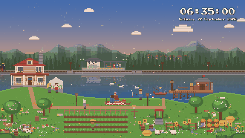

# Starfall Farm

A cozy, farming sim inspired live wallpaper for [Wallpaper Engine](https://www.wallpaperengine.io/), built entirely with HTML, CSS, JavaScript, and the Web Audio API.

**[Get it on the Steam Workshop](https://steamcommunity.com/sharedfiles/filedetails/?id=3806608207)**



*Dawn, morning, noon, golden hour, dusk, and night, all rendered live in the wallpaper itself.*

## Overview

A pond side farm scene with a real day and night cycle, four seasons, seven weather types, a small original cast of villagers and animals, and a steam train that passes and stops at a lakeside station. The music and ambience are fully generative too, so there are no external audio or video files and no copyrighted game assets involved. Everything you see and hear is drawn and synthesized live in the browser.

## Features

- **Real time day/night cycle**: the sun and moon move across the sky based on your system clock (or a manual hour, for testing), and the moon phase follows the real date.
- **Sunrise/sunset sync**: optionally enter your latitude and longitude for a real world sunrise and sunset time. This is calculated entirely on device, and nothing is sent anywhere.
- **Four seasons**: Spring, Summer, Fall, and Winter, either automatic (rotating every 28 in wallpaper days) or fixed. Each season shifts the palette, foliage, and particle effects, including petals, fireflies, falling leaves, and snow.
- **Seven weather types**: Clear, Cloudy, Rain, Thunderstorm, Fog, Windy, and Random, with smooth transitions, lightning flashes, and a rainbow that appears once the rain clears.
- **Sky detail**: twinkling stars, shooting stars with an adjustable frequency, and drifting clouds, all dimmed appropriately in daylight.
- **Original cast**: a wandering couple, five villagers with their own routines, and farm animals such as chickens, cows, sheep, a cat, a dog, rabbits, and ducks. All designs are original pixel art with day/night and weather aware behavior.
- **Character editor**: customize the couple's skin tone, hairstyle, hair color, shirt, and pants directly from Wallpaper Engine's properties panel.
- **Steam train**: an 8 car passenger train that stops at a small lakeside station, complete with waiting passengers who board, alternating with an 8 car freight train that passes through without stopping.
- **Pond life**: a moored fishing boat, a passing fishing ship, swimming ducks, and (in summer) dragonflies skimming the water.
- **Evening picnic**: a couple settles by the lake at dusk for a small recurring scene.
- **Original audio**: background music with four seasonal themes, synthesized rather than sampled, plus ambient sound for rain, thunder, wind, crickets, the campfire, the train, and the boat. Everything is generated with the Web Audio API, so no copyrighted or third party audio is included.
- **Customizable clock**: 12 or 24 hour format, seconds, date, language (English or Indonesian), a position you can nudge anywhere on screen, and adjustable size.
- **50+ properties** in total, grouped by category in the Wallpaper Engine panel: Time & Sky, Season & Weather, Residents & Wildlife, Character Editor, Music & Ambient Sound, Clock Display, and Performance.

## Files

```
.
├── index.html          the entire wallpaper: scene, animation, and audio engine
├── project.json         Wallpaper Engine project definition and properties
├── preview.png           Workshop and library thumbnail
├── preview.gif           animated preview used in this README
├── pressstart2p.woff2    bundled clock font
└── OFL.txt              SIL Open Font License for the bundled font
```

Everything is self contained in a single HTML file. There is no build step, no external dependencies, and no network requests.

## Installation

**Option A: Steam Workshop**
Subscribe from the [Workshop page](https://steamcommunity.com/sharedfiles/filedetails/?id=3806608207) and Wallpaper Engine handles the rest.

**Option B: Manual or local build**
1. Copy this whole folder into your Wallpaper Engine projects directory, for example
   `Steam\steamapps\common\wallpaper_engine\projects\myprojects\starfall-farm\`
2. Open Wallpaper Engine, go to the **Installed** tab (or use **Open Wallpaper → Open from File** and pick `project.json`).
3. Select it and set it as your active wallpaper.

## Customization

All settings are available from Wallpaper Engine's **Properties** panel once the wallpaper is applied, so no code editing is required. A few worth knowing about:

- **Performance**: lower the FPS cap if the wallpaper competes with games or other GPU heavy apps.
- **Season & Weather → Sync sunrise/sunset to coordinates**: enter your latitude and longitude for locally accurate sun timing.
- **Music & Ambient Sound**: separate on/off switches and volume sliders for music and ambience, plus a fixed or automatic music theme.

If you do want to edit it directly, everything lives in `index.html`. The scene is drawn procedurally on an HTML `<canvas>`, animals, villagers, and objects are depth sorted each frame, and the audio engine (search for `MU` and `AM` in the script) synthesizes every note and sound effect at runtime.

## Credits

All artwork, animation, music, and sound effects were created specifically for this project. No assets from Stardew Valley or any other game are used, and this project isn't affiliated with or endorsed by ConcernedApe.

Clock font: [Press Start 2P](https://fonts.google.com/specimen/Press+Start+2P) by CodeMan38, licensed under the [SIL Open Font License 1.1](OFL.txt).

## License

Choose a license for your own code and art before publishing (MIT is a reasonable choice for the code) and note it here. The bundled font keeps its own OFL license regardless of what you choose for the rest of the project.

